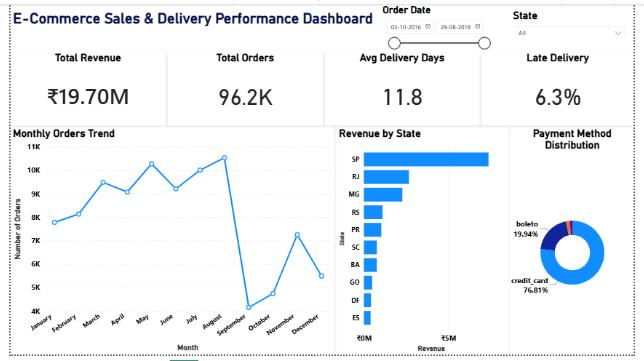

# E-Commerce-Sales-Analytics

## Project Overview

This project analyzes e-commerce sales and delivery operations using Python, SQL, and Power BI. The objective was to evaluate order performance, delivery efficiency, payment behavior, and regional revenue distribution by transforming raw transactional data into actionable business insights.

The project follows a complete analytics workflow, including data cleaning, exploratory data analysis (EDA), SQL-based reporting, KPI development, and interactive dashboard creation.

---

## Business Questions

* How many orders were processed by the business?
* What is the overall delivery performance?
* How long does delivery take on average?
* What percentage of orders are delivered late?
* How has order volume changed over time?
* Which states generate the highest revenue?
* Which payment methods are most frequently used?
* How effective is the order fulfillment process?

---

## Dataset Information

### Source Datasets

| Dataset     | Records |
| ----------- | ------: |
| Orders      |  99,441 |
| Customers   |  99,441 |
| Payments    | 103,886 |
| Order Items |   112K+ |

### Final Analytical Dataset

| Metric                |   Value |
| --------------------- | ------: |
| Cleaned Orders        |  99,281 |
| Final Dataset Rows    | 114,671 |
| Total Columns         |      27 |
| Total Revenue         | ₹19.70M |
| Total Orders          |   96.2K |
| Average Delivery Days |    11.8 |
| Late Delivery Rate    |    6.3% |

### Analysis Period

September 2016 – August 2018

---

## Tools & Technologies

* Python
* Pandas
* MySQL
* SQL
* Power BI
* Data Visualization
* Exploratory Data Analysis (EDA)
* Business Intelligence Reporting

---

## Data Cleaning & EDA

Data preparation was performed using Python (Pandas) to ensure data quality and reliable analysis.

### Data Cleaning

* Validated dataset structure, data types, and missing values.
* Converted timestamp columns into datetime format.
* Removed records with missing order approval timestamps.
* Removed duplicate records.
* Standardized customer state values.
* Merged datasets using:

  * customer_id (Orders ↔ Customers)
  * order_id (Orders ↔ Order Items)
  * order_id (Orders ↔ Payments)
* Created a consolidated analytical dataset containing 114,671 rows and 27 columns for analysis and reporting.

### Feature Engineering

Created analytical features including:

* Delivery Days
* Delivery Delay
* Order Month
* Order Year
* Order Month Number

### Exploratory Analysis

* Order Status Distribution
* Monthly Order Trend Analysis
* Delivery Time Analysis
* Delivery Delay Analysis
* Late Delivery Percentage Analysis
* Fulfillment Performance Analysis

---

## Key EDA Findings

* 97.16% of orders were successfully delivered.
* Average delivery time was 11.8 days.
* Only 6.3% of deliveries arrived later than the estimated delivery date.
* Order volume increased significantly between 2017 and 2018.
* Revenue contribution was concentrated across a small number of states, with São Paulo (SP) generating the highest revenue.

---

## SQL Analysis

SQL was used to generate operational KPIs, monitor delivery performance, analyze customer activity, and evaluate business trends across orders and fulfillment operations.

### Analysis Performed

* Total Orders Analysis
* Total Customers Analysis
* Order Status Distribution
* Monthly Order Trend Analysis
* Average Delivery Time Analysis
* Late Delivery Percentage Analysis
* Late vs On-Time Delivery Analysis
* Delivery Performance by Order Status

### Sample Business Query

```sql
SELECT
    DATE_FORMAT(order_purchase_timestamp,'%Y-%m') AS order_month,
    COUNT(DISTINCT order_id) AS total_orders
FROM olist_orders_dataset
GROUP BY order_month
ORDER BY order_month;
```

This query was used to monitor monthly order volume trends and evaluate business growth patterns throughout the analysis period.

---

## Power BI Dashboard

The dashboard provides an interactive view of sales performance, delivery efficiency, payment behavior, and regional revenue contribution.

It enables stakeholders to monitor key business KPIs, evaluate operational performance, identify growth opportunities, and support data-driven decision-making.

### Dashboard KPIs

* Total Revenue: ₹19.70M
* Total Orders: 96.2K
* Average Delivery Days: 11.8
* Late Delivery Rate: 6.3%

### Dashboard Preview



---

## Project Files

### Power BI Dashboard

Interactive Power BI dashboard containing KPIs, sales trends, delivery performance metrics, payment behavior analysis, and regional revenue insights.

[ecommerce_sales_delivery_dashboard.pbix](./ecommerce_sales_delivery_dashboard.pbix)

### EDA Notebook

Python notebook covering data cleaning, feature engineering, exploratory analysis, and dataset preparation.

[ecommerce_sales_delivery_analysis.ipynb](./ecommerce_sales_delivery_analysis.ipynb)

### SQL Analysis

Business-focused SQL queries used for KPI reporting, operational analysis, trend monitoring, and performance evaluation.

[ecommerce_sales_delivery_analysis.sql](./ecommerce_sales_delivery_analysis.sql)

### Dashboard Image

Dashboard preview used within the project documentation.

[ecommerce_dashboard.png](./ecommerce_dashboard.png)

---

## Key Business Insights

### Delivery Performance

* Approximately 97.16% of orders were successfully delivered.
* Average delivery time was 11.8 days.
* Only 6.3% of deliveries arrived later than the estimated delivery date.

### Order Trends

* Monthly orders increased from fewer than 1,000 orders in early 2017 to more than 7,500 orders during peak periods.
* The growth trend indicates increasing customer adoption and business expansion over time.

### Payment Behavior

* Credit cards accounted for approximately 76.8% of all transactions, making them the dominant payment method.
* Alternative payment methods represented a smaller share of customer purchases.

### Geographic Performance

* Revenue contribution was concentrated across a limited number of states.
* São Paulo (SP) generated the highest revenue contribution, highlighting its importance to overall business performance.

---

## Conclusion

This project demonstrates an end-to-end data analytics workflow using Python, SQL, and Power BI. Through data cleaning, exploratory analysis, SQL reporting, KPI development, and dashboard creation, the project evaluates e-commerce sales performance, delivery efficiency, payment behavior, and regional revenue distribution while transforming raw transactional data into actionable business insights.
